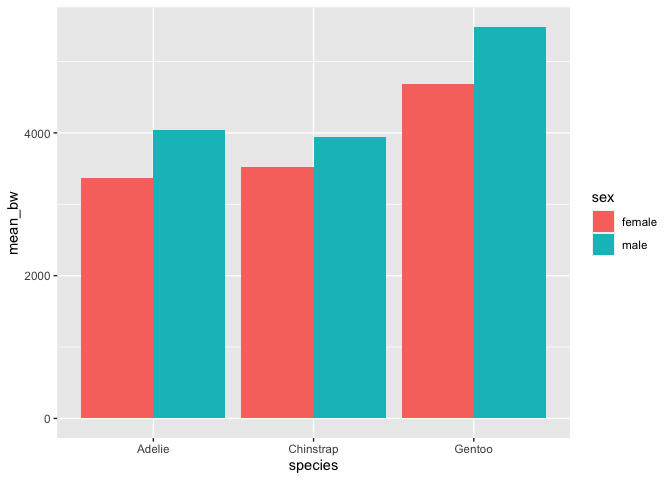
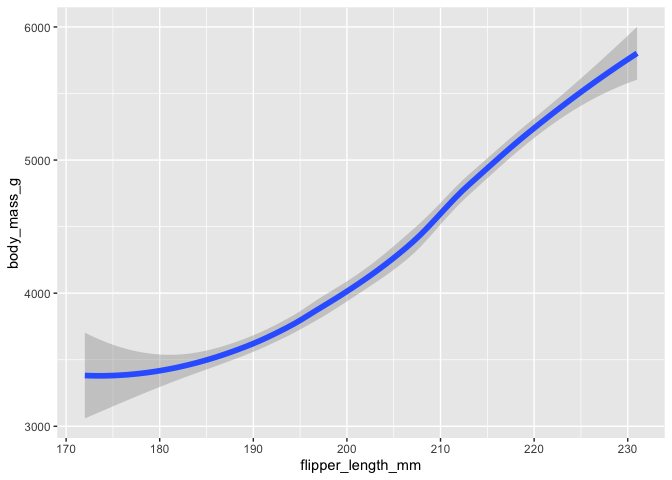

# Teaching the Tidyverse in 2023

``` r
library(tidyverse)
```

    ── Attaching core tidyverse packages ──────────────────────── tidyverse 2.0.0 ──
    ✔ dplyr     1.1.2     ✔ readr     2.1.4
    ✔ forcats   1.0.0     ✔ stringr   1.5.0
    ✔ ggplot2   3.4.2     ✔ tibble    3.2.1
    ✔ lubridate 1.9.2     ✔ tidyr     1.3.0
    ✔ purrr     1.0.1     
    ── Conflicts ────────────────────────────────────────── tidyverse_conflicts() ──
    ✖ dplyr::filter() masks stats::filter()
    ✖ dplyr::lag()    masks stats::lag()
    ℹ Use the conflicted package (<http://conflicted.r-lib.org/>) to force all conflicts to become errors

``` r
library(palmerpenguins)
library(gt)
library(pkgload)
```


    Attaching package: 'pkgload'

    The following objects are masked from 'package:devtools':

        has_tests, load_all, package_file

# Native pipe

``` r
mpg %>%
  count(class)
```

    # A tibble: 7 × 2
      class          n
      <chr>      <int>
    1 2seater        5
    2 compact       47
    3 midsize       41
    4 minivan       11
    5 pickup        33
    6 subcompact    35
    7 suv           62

# Nine core packages in tidyverse 2.0.0

``` r
library(tidyverse)
library(lubridate)

today_n <- 20230719
class(today_n)
```

    [1] "numeric"

``` r
ymd(today_n)
```

    [1] "2023-07-19"

``` r
class(ymd(today_n))
```

    [1] "Date"

# Conflict resolution in the tidyverse

``` r
library(tidyverse)
tidyverse_conflicts()
```

    ── Conflicts ────────────────────────────────────────── tidyverse_conflicts() ──
    ✖ dplyr::filter() masks stats::filter()
    ✖ dplyr::lag()    masks stats::lag()
    ℹ Use the conflicted package (<http://conflicted.r-lib.org/>) to force all conflicts to become errors

- Base R conflict resolution:

``` r
pkgload::unload("dplyr")

penguins |>
  filter(species == "Adelie")
```

    Error in eval(expr, envir, enclos): object 'species' not found

``` r
library(dplyr)
```


    Attaching package: 'dplyr'

    The following object is masked from 'package:gt':

        vars

    The following object is masked from 'package:ggplot2':

        vars

    The following objects are masked from 'package:stats':

        filter, lag

    The following objects are masked from 'package:base':

        intersect, setdiff, setequal, union

``` r
penguins |>
  filter(species == "Adelie")
```

    # A tibble: 152 × 8
       species island    bill_length_mm bill_depth_mm flipper_length_mm body_mass_g
       <fct>   <fct>              <dbl>         <dbl>             <int>       <int>
     1 Adelie  Torgersen           39.1          18.7               181        3750
     2 Adelie  Torgersen           39.5          17.4               186        3800
     3 Adelie  Torgersen           40.3          18                 195        3250
     4 Adelie  Torgersen           NA            NA                  NA          NA
     5 Adelie  Torgersen           36.7          19.3               193        3450
     6 Adelie  Torgersen           39.3          20.6               190        3650
     7 Adelie  Torgersen           38.9          17.8               181        3625
     8 Adelie  Torgersen           39.2          19.6               195        4675
     9 Adelie  Torgersen           34.1          18.1               193        3475
    10 Adelie  Torgersen           42            20.2               190        4250
    # ℹ 142 more rows
    # ℹ 2 more variables: sex <fct>, year <int>

- Conflict resolution with conflicted:

``` r
library(conflicted)

penguins |>
  filter(species == "Adelie")
```

    Error:
    ! [conflicted] filter found in 2 packages.
    Either pick the one you want with `::`:
    • dplyr::filter
    • stats::filter
    Or declare a preference with `conflicts_prefer()`:
    • `conflicts_prefer(dplyr::filter)`
    • `conflicts_prefer(stats::filter)`

``` r
# option 1: with ::
penguins |>
  dplyr::filter(species == "Adelie")
```

    # A tibble: 152 × 8
       species island    bill_length_mm bill_depth_mm flipper_length_mm body_mass_g
       <fct>   <fct>              <dbl>         <dbl>             <int>       <int>
     1 Adelie  Torgersen           39.1          18.7               181        3750
     2 Adelie  Torgersen           39.5          17.4               186        3800
     3 Adelie  Torgersen           40.3          18                 195        3250
     4 Adelie  Torgersen           NA            NA                  NA          NA
     5 Adelie  Torgersen           36.7          19.3               193        3450
     6 Adelie  Torgersen           39.3          20.6               190        3650
     7 Adelie  Torgersen           38.9          17.8               181        3625
     8 Adelie  Torgersen           39.2          19.6               195        4675
     9 Adelie  Torgersen           34.1          18.1               193        3475
    10 Adelie  Torgersen           42            20.2               190        4250
    # ℹ 142 more rows
    # ℹ 2 more variables: sex <fct>, year <int>

``` r
# option 2: with conflicts_prefer()
conflicts_prefer(dplyr::filter)
```

    [conflicted] Will prefer dplyr::filter over any other package.

``` r
penguins |>
  filter(species == "Adelie")
```

    # A tibble: 152 × 8
       species island    bill_length_mm bill_depth_mm flipper_length_mm body_mass_g
       <fct>   <fct>              <dbl>         <dbl>             <int>       <int>
     1 Adelie  Torgersen           39.1          18.7               181        3750
     2 Adelie  Torgersen           39.5          17.4               186        3800
     3 Adelie  Torgersen           40.3          18                 195        3250
     4 Adelie  Torgersen           NA            NA                  NA          NA
     5 Adelie  Torgersen           36.7          19.3               193        3450
     6 Adelie  Torgersen           39.3          20.6               190        3650
     7 Adelie  Torgersen           38.9          17.8               181        3625
     8 Adelie  Torgersen           39.2          19.6               195        4675
     9 Adelie  Torgersen           34.1          18.1               193        3475
    10 Adelie  Torgersen           42            20.2               190        4250
    # ℹ 142 more rows
    # ℹ 2 more variables: sex <fct>, year <int>

# Improved and expanded `*_join()` functionality

- New join tool: `join_by()`:

``` r
# information on three islands
islands <- tribble(
  ~name,       ~coordinates,
  "Torgersen", "64°46′S 64°5′W",
  "Biscoe",    "65°26′S 65°30′W",
  "Dream",     "64°44′S 64°14′W"
)

islands
```

    # A tibble: 3 × 2
      name      coordinates    
      <chr>     <chr>          
    1 Torgersen 64°46′S 64°5′W 
    2 Biscoe    65°26′S 65°30′W
    3 Dream     64°44′S 64°14′W

``` r
penguins |>
  left_join(
    islands, 
    by = c("island" = "name")
  ) |>
  select(species, island, coordinates)
```

    # A tibble: 344 × 3
       species island    coordinates   
       <fct>   <chr>     <chr>         
     1 Adelie  Torgersen 64°46′S 64°5′W
     2 Adelie  Torgersen 64°46′S 64°5′W
     3 Adelie  Torgersen 64°46′S 64°5′W
     4 Adelie  Torgersen 64°46′S 64°5′W
     5 Adelie  Torgersen 64°46′S 64°5′W
     6 Adelie  Torgersen 64°46′S 64°5′W
     7 Adelie  Torgersen 64°46′S 64°5′W
     8 Adelie  Torgersen 64°46′S 64°5′W
     9 Adelie  Torgersen 64°46′S 64°5′W
    10 Adelie  Torgersen 64°46′S 64°5′W
    # ℹ 334 more rows

- Many-to-many relationships:

``` r
# data on three penguins, one row per samp_id
three_penguins <- tribble(
  ~samp_id, ~species,    ~island,
  1,        "Adelie",    "Torgersen",
  2,        "Gentoo",    "Biscoe",
  3,        "Chinstrap", "Dream"
)

three_penguins
```

    # A tibble: 3 × 3
      samp_id species   island   
        <dbl> <chr>     <chr>    
    1       1 Adelie    Torgersen
    2       2 Gentoo    Biscoe   
    3       3 Chinstrap Dream    

``` r
# data on weight measurements of these penguins, one row per samp_id, meas_id combo
weight_measurements <- tribble(
  ~samp_id, ~meas_id, ~body_mass_g,
  1,        1,        3220,
  1,        2,        3250,
  2,        1,        4730,
  2,        2,        4725,
  3,        1,        4000,
  3,        2,        4050
)

weight_measurements
```

    # A tibble: 6 × 3
      samp_id meas_id body_mass_g
        <dbl>   <dbl>       <dbl>
    1       1       1        3220
    2       1       2        3250
    3       2       1        4730
    4       2       2        4725
    5       3       1        4000
    6       3       2        4050

``` r
# data on flipper length measurements of these penguins, one row per samp_id, meas_id combo
flipper_measurements <- tribble(
  ~samp_id, ~meas_id, ~flipper_length_mm,
  1,        1,        193,
  1,        2,        195,
  2,        1,        214,
  2,        2,        216,
  3,        1,        203,
  3,        2,        203
)

flipper_measurements
```

    # A tibble: 6 × 3
      samp_id meas_id flipper_length_mm
        <dbl>   <dbl>             <dbl>
    1       1       1               193
    2       1       2               195
    3       2       1               214
    4       2       2               216
    5       3       1               203
    6       3       2               203

``` r
# one-to-many relationships
three_penguins |>
  left_join(weight_measurements, join_by(samp_id))
```

    # A tibble: 6 × 5
      samp_id species   island    meas_id body_mass_g
        <dbl> <chr>     <chr>       <dbl>       <dbl>
    1       1 Adelie    Torgersen       1        3220
    2       1 Adelie    Torgersen       2        3250
    3       2 Gentoo    Biscoe          1        4730
    4       2 Gentoo    Biscoe          2        4725
    5       3 Chinstrap Dream           1        4000
    6       3 Chinstrap Dream           2        4050

``` r
# many-to-many relationships
weight_measurements |>
  left_join(flipper_measurements, join_by(samp_id))
```

    Warning in left_join(weight_measurements, flipper_measurements, join_by(samp_id)): Detected an unexpected many-to-many relationship between `x` and `y`.
    ℹ Row 1 of `x` matches multiple rows in `y`.
    ℹ Row 1 of `y` matches multiple rows in `x`.
    ℹ If a many-to-many relationship is expected, set `relationship =
      "many-to-many"` to silence this warning.

    # A tibble: 12 × 5
       samp_id meas_id.x body_mass_g meas_id.y flipper_length_mm
         <dbl>     <dbl>       <dbl>     <dbl>             <dbl>
     1       1         1        3220         1               193
     2       1         1        3220         2               195
     3       1         2        3250         1               193
     4       1         2        3250         2               195
     5       2         1        4730         1               214
     6       2         1        4730         2               216
     7       2         2        4725         1               214
     8       2         2        4725         2               216
     9       3         1        4000         1               203
    10       3         1        4000         2               203
    11       3         2        4050         1               203
    12       3         2        4050         2               203

- Unmatched cases:

``` r
# data on four penguins, one row per samp_id
four_penguins <- tribble(
  ~samp_id, ~species,    ~island,
  1,        "Adelie",    "Torgersen",
  2,        "Gentoo",    "Biscoe",
  3,        "Chinstrap", "Dream",
  4,        "Adelie",    "Biscoe"
)

four_penguins
```

    # A tibble: 4 × 3
      samp_id species   island   
        <dbl> <chr>     <chr>    
    1       1 Adelie    Torgersen
    2       2 Gentoo    Biscoe   
    3       3 Chinstrap Dream    
    4       4 Adelie    Biscoe   

``` r
# unmatched rows
weight_measurements |>
  left_join(four_penguins, join_by(samp_id))
```

    # A tibble: 6 × 5
      samp_id meas_id body_mass_g species   island   
        <dbl>   <dbl>       <dbl> <chr>     <chr>    
    1       1       1        3220 Adelie    Torgersen
    2       1       2        3250 Adelie    Torgersen
    3       2       1        4730 Gentoo    Biscoe   
    4       2       2        4725 Gentoo    Biscoe   
    5       3       1        4000 Chinstrap Dream    
    6       3       2        4050 Chinstrap Dream    

``` r
# option 1: with inner_join()
weight_measurements |>
  inner_join(four_penguins, join_by(samp_id))
```

    # A tibble: 6 × 5
      samp_id meas_id body_mass_g species   island   
        <dbl>   <dbl>       <dbl> <chr>     <chr>    
    1       1       1        3220 Adelie    Torgersen
    2       1       2        3250 Adelie    Torgersen
    3       2       1        4730 Gentoo    Biscoe   
    4       2       2        4725 Gentoo    Biscoe   
    5       3       1        4000 Chinstrap Dream    
    6       3       2        4050 Chinstrap Dream    

``` r
# option 2: with unmatched = "drop"
weight_measurements |>
  left_join(four_penguins, join_by(samp_id), unmatched = "drop")
```

    # A tibble: 6 × 5
      samp_id meas_id body_mass_g species   island   
        <dbl>   <dbl>       <dbl> <chr>     <chr>    
    1       1       1        3220 Adelie    Torgersen
    2       1       2        3250 Adelie    Torgersen
    3       2       1        4730 Gentoo    Biscoe   
    4       2       2        4725 Gentoo    Biscoe   
    5       3       1        4000 Chinstrap Dream    
    6       3       2        4050 Chinstrap Dream    

``` r
# option 3: do nothimg, at your own risk
weight_measurements |>
  left_join(four_penguins, join_by(samp_id))
```

    # A tibble: 6 × 5
      samp_id meas_id body_mass_g species   island   
        <dbl>   <dbl>       <dbl> <chr>     <chr>    
    1       1       1        3220 Adelie    Torgersen
    2       1       2        3250 Adelie    Torgersen
    3       2       1        4730 Gentoo    Biscoe   
    4       2       2        4725 Gentoo    Biscoe   
    5       3       1        4000 Chinstrap Dream    
    6       3       2        4050 Chinstrap Dream    

# Per operation grouping

``` r
# typical tidyverse pipeline: plot mean body weights of penguins by species and sex

penguins |>
  drop_na(sex, body_mass_g) |>
  group_by(species, sex) |>
  summarize(mean_bw = mean(body_mass_g)) |>
  ggplot(aes(x = species, y = mean_bw, fill = sex)) +
  geom_col(position = "dodge")
```

    `summarise()` has grouped output by 'species'. You can override using the
    `.groups` argument.



``` r
# example 1: persistent grouping, downstream effects
penguins |>
  drop_na(sex, body_mass_g) |>
  group_by(species, sex) |>
  summarize(mean_bw = mean(body_mass_g)) |>
  slice_head(n = 1)
```

    `summarise()` has grouped output by 'species'. You can override using the
    `.groups` argument.

    # A tibble: 3 × 3
    # Groups:   species [3]
      species   sex    mean_bw
      <fct>     <fct>    <dbl>
    1 Adelie    female   3369.
    2 Chinstrap female   3527.
    3 Gentoo    female   4680.

``` r
penguins |>
  drop_na(sex, body_mass_g) |>
  group_by(species, sex) |>
  summarize(mean_bw = mean(body_mass_g), .groups = "drop") |>
  slice_head(n = 1)
```

    # A tibble: 1 × 3
      species sex    mean_bw
      <fct>   <fct>    <dbl>
    1 Adelie  female   3369.

``` r
# example 2: persistent grouping, downstream effects
penguins |>
  drop_na(sex, body_mass_g) |>
  group_by(species, sex) |>
  summarize(mean_bw = mean(body_mass_g)) |>
  gt::gt()
```

    `summarise()` has grouped output by 'species'. You can override using the
    `.groups` argument.

<div id="zfwdixoewe" style="padding-left:0px;padding-right:0px;padding-top:10px;padding-bottom:10px;overflow-x:auto;overflow-y:auto;width:auto;height:auto;">
<style>#zfwdixoewe table {
  font-family: system-ui, 'Segoe UI', Roboto, Helvetica, Arial, sans-serif, 'Apple Color Emoji', 'Segoe UI Emoji', 'Segoe UI Symbol', 'Noto Color Emoji';
  -webkit-font-smoothing: antialiased;
  -moz-osx-font-smoothing: grayscale;
}
&#10;#zfwdixoewe thead, #zfwdixoewe tbody, #zfwdixoewe tfoot, #zfwdixoewe tr, #zfwdixoewe td, #zfwdixoewe th {
  border-style: none;
}
&#10;#zfwdixoewe p {
  margin: 0;
  padding: 0;
}
&#10;#zfwdixoewe .gt_table {
  display: table;
  border-collapse: collapse;
  line-height: normal;
  margin-left: auto;
  margin-right: auto;
  color: #333333;
  font-size: 16px;
  font-weight: normal;
  font-style: normal;
  background-color: #FFFFFF;
  width: auto;
  border-top-style: solid;
  border-top-width: 2px;
  border-top-color: #A8A8A8;
  border-right-style: none;
  border-right-width: 2px;
  border-right-color: #D3D3D3;
  border-bottom-style: solid;
  border-bottom-width: 2px;
  border-bottom-color: #A8A8A8;
  border-left-style: none;
  border-left-width: 2px;
  border-left-color: #D3D3D3;
}
&#10;#zfwdixoewe .gt_caption {
  padding-top: 4px;
  padding-bottom: 4px;
}
&#10;#zfwdixoewe .gt_title {
  color: #333333;
  font-size: 125%;
  font-weight: initial;
  padding-top: 4px;
  padding-bottom: 4px;
  padding-left: 5px;
  padding-right: 5px;
  border-bottom-color: #FFFFFF;
  border-bottom-width: 0;
}
&#10;#zfwdixoewe .gt_subtitle {
  color: #333333;
  font-size: 85%;
  font-weight: initial;
  padding-top: 3px;
  padding-bottom: 5px;
  padding-left: 5px;
  padding-right: 5px;
  border-top-color: #FFFFFF;
  border-top-width: 0;
}
&#10;#zfwdixoewe .gt_heading {
  background-color: #FFFFFF;
  text-align: center;
  border-bottom-color: #FFFFFF;
  border-left-style: none;
  border-left-width: 1px;
  border-left-color: #D3D3D3;
  border-right-style: none;
  border-right-width: 1px;
  border-right-color: #D3D3D3;
}
&#10;#zfwdixoewe .gt_bottom_border {
  border-bottom-style: solid;
  border-bottom-width: 2px;
  border-bottom-color: #D3D3D3;
}
&#10;#zfwdixoewe .gt_col_headings {
  border-top-style: solid;
  border-top-width: 2px;
  border-top-color: #D3D3D3;
  border-bottom-style: solid;
  border-bottom-width: 2px;
  border-bottom-color: #D3D3D3;
  border-left-style: none;
  border-left-width: 1px;
  border-left-color: #D3D3D3;
  border-right-style: none;
  border-right-width: 1px;
  border-right-color: #D3D3D3;
}
&#10;#zfwdixoewe .gt_col_heading {
  color: #333333;
  background-color: #FFFFFF;
  font-size: 100%;
  font-weight: normal;
  text-transform: inherit;
  border-left-style: none;
  border-left-width: 1px;
  border-left-color: #D3D3D3;
  border-right-style: none;
  border-right-width: 1px;
  border-right-color: #D3D3D3;
  vertical-align: bottom;
  padding-top: 5px;
  padding-bottom: 6px;
  padding-left: 5px;
  padding-right: 5px;
  overflow-x: hidden;
}
&#10;#zfwdixoewe .gt_column_spanner_outer {
  color: #333333;
  background-color: #FFFFFF;
  font-size: 100%;
  font-weight: normal;
  text-transform: inherit;
  padding-top: 0;
  padding-bottom: 0;
  padding-left: 4px;
  padding-right: 4px;
}
&#10;#zfwdixoewe .gt_column_spanner_outer:first-child {
  padding-left: 0;
}
&#10;#zfwdixoewe .gt_column_spanner_outer:last-child {
  padding-right: 0;
}
&#10;#zfwdixoewe .gt_column_spanner {
  border-bottom-style: solid;
  border-bottom-width: 2px;
  border-bottom-color: #D3D3D3;
  vertical-align: bottom;
  padding-top: 5px;
  padding-bottom: 5px;
  overflow-x: hidden;
  display: inline-block;
  width: 100%;
}
&#10;#zfwdixoewe .gt_spanner_row {
  border-bottom-style: hidden;
}
&#10;#zfwdixoewe .gt_group_heading {
  padding-top: 8px;
  padding-bottom: 8px;
  padding-left: 5px;
  padding-right: 5px;
  color: #333333;
  background-color: #FFFFFF;
  font-size: 100%;
  font-weight: initial;
  text-transform: inherit;
  border-top-style: solid;
  border-top-width: 2px;
  border-top-color: #D3D3D3;
  border-bottom-style: solid;
  border-bottom-width: 2px;
  border-bottom-color: #D3D3D3;
  border-left-style: none;
  border-left-width: 1px;
  border-left-color: #D3D3D3;
  border-right-style: none;
  border-right-width: 1px;
  border-right-color: #D3D3D3;
  vertical-align: middle;
  text-align: left;
}
&#10;#zfwdixoewe .gt_empty_group_heading {
  padding: 0.5px;
  color: #333333;
  background-color: #FFFFFF;
  font-size: 100%;
  font-weight: initial;
  border-top-style: solid;
  border-top-width: 2px;
  border-top-color: #D3D3D3;
  border-bottom-style: solid;
  border-bottom-width: 2px;
  border-bottom-color: #D3D3D3;
  vertical-align: middle;
}
&#10;#zfwdixoewe .gt_from_md > :first-child {
  margin-top: 0;
}
&#10;#zfwdixoewe .gt_from_md > :last-child {
  margin-bottom: 0;
}
&#10;#zfwdixoewe .gt_row {
  padding-top: 8px;
  padding-bottom: 8px;
  padding-left: 5px;
  padding-right: 5px;
  margin: 10px;
  border-top-style: solid;
  border-top-width: 1px;
  border-top-color: #D3D3D3;
  border-left-style: none;
  border-left-width: 1px;
  border-left-color: #D3D3D3;
  border-right-style: none;
  border-right-width: 1px;
  border-right-color: #D3D3D3;
  vertical-align: middle;
  overflow-x: hidden;
}
&#10;#zfwdixoewe .gt_stub {
  color: #333333;
  background-color: #FFFFFF;
  font-size: 100%;
  font-weight: initial;
  text-transform: inherit;
  border-right-style: solid;
  border-right-width: 2px;
  border-right-color: #D3D3D3;
  padding-left: 5px;
  padding-right: 5px;
}
&#10;#zfwdixoewe .gt_stub_row_group {
  color: #333333;
  background-color: #FFFFFF;
  font-size: 100%;
  font-weight: initial;
  text-transform: inherit;
  border-right-style: solid;
  border-right-width: 2px;
  border-right-color: #D3D3D3;
  padding-left: 5px;
  padding-right: 5px;
  vertical-align: top;
}
&#10;#zfwdixoewe .gt_row_group_first td {
  border-top-width: 2px;
}
&#10;#zfwdixoewe .gt_row_group_first th {
  border-top-width: 2px;
}
&#10;#zfwdixoewe .gt_summary_row {
  color: #333333;
  background-color: #FFFFFF;
  text-transform: inherit;
  padding-top: 8px;
  padding-bottom: 8px;
  padding-left: 5px;
  padding-right: 5px;
}
&#10;#zfwdixoewe .gt_first_summary_row {
  border-top-style: solid;
  border-top-color: #D3D3D3;
}
&#10;#zfwdixoewe .gt_first_summary_row.thick {
  border-top-width: 2px;
}
&#10;#zfwdixoewe .gt_last_summary_row {
  padding-top: 8px;
  padding-bottom: 8px;
  padding-left: 5px;
  padding-right: 5px;
  border-bottom-style: solid;
  border-bottom-width: 2px;
  border-bottom-color: #D3D3D3;
}
&#10;#zfwdixoewe .gt_grand_summary_row {
  color: #333333;
  background-color: #FFFFFF;
  text-transform: inherit;
  padding-top: 8px;
  padding-bottom: 8px;
  padding-left: 5px;
  padding-right: 5px;
}
&#10;#zfwdixoewe .gt_first_grand_summary_row {
  padding-top: 8px;
  padding-bottom: 8px;
  padding-left: 5px;
  padding-right: 5px;
  border-top-style: double;
  border-top-width: 6px;
  border-top-color: #D3D3D3;
}
&#10;#zfwdixoewe .gt_last_grand_summary_row_top {
  padding-top: 8px;
  padding-bottom: 8px;
  padding-left: 5px;
  padding-right: 5px;
  border-bottom-style: double;
  border-bottom-width: 6px;
  border-bottom-color: #D3D3D3;
}
&#10;#zfwdixoewe .gt_striped {
  background-color: rgba(128, 128, 128, 0.05);
}
&#10;#zfwdixoewe .gt_table_body {
  border-top-style: solid;
  border-top-width: 2px;
  border-top-color: #D3D3D3;
  border-bottom-style: solid;
  border-bottom-width: 2px;
  border-bottom-color: #D3D3D3;
}
&#10;#zfwdixoewe .gt_footnotes {
  color: #333333;
  background-color: #FFFFFF;
  border-bottom-style: none;
  border-bottom-width: 2px;
  border-bottom-color: #D3D3D3;
  border-left-style: none;
  border-left-width: 2px;
  border-left-color: #D3D3D3;
  border-right-style: none;
  border-right-width: 2px;
  border-right-color: #D3D3D3;
}
&#10;#zfwdixoewe .gt_footnote {
  margin: 0px;
  font-size: 90%;
  padding-top: 4px;
  padding-bottom: 4px;
  padding-left: 5px;
  padding-right: 5px;
}
&#10;#zfwdixoewe .gt_sourcenotes {
  color: #333333;
  background-color: #FFFFFF;
  border-bottom-style: none;
  border-bottom-width: 2px;
  border-bottom-color: #D3D3D3;
  border-left-style: none;
  border-left-width: 2px;
  border-left-color: #D3D3D3;
  border-right-style: none;
  border-right-width: 2px;
  border-right-color: #D3D3D3;
}
&#10;#zfwdixoewe .gt_sourcenote {
  font-size: 90%;
  padding-top: 4px;
  padding-bottom: 4px;
  padding-left: 5px;
  padding-right: 5px;
}
&#10;#zfwdixoewe .gt_left {
  text-align: left;
}
&#10;#zfwdixoewe .gt_center {
  text-align: center;
}
&#10;#zfwdixoewe .gt_right {
  text-align: right;
  font-variant-numeric: tabular-nums;
}
&#10;#zfwdixoewe .gt_font_normal {
  font-weight: normal;
}
&#10;#zfwdixoewe .gt_font_bold {
  font-weight: bold;
}
&#10;#zfwdixoewe .gt_font_italic {
  font-style: italic;
}
&#10;#zfwdixoewe .gt_super {
  font-size: 65%;
}
&#10;#zfwdixoewe .gt_footnote_marks {
  font-size: 75%;
  vertical-align: 0.4em;
  position: initial;
}
&#10;#zfwdixoewe .gt_asterisk {
  font-size: 100%;
  vertical-align: 0;
}
&#10;#zfwdixoewe .gt_indent_1 {
  text-indent: 5px;
}
&#10;#zfwdixoewe .gt_indent_2 {
  text-indent: 10px;
}
&#10;#zfwdixoewe .gt_indent_3 {
  text-indent: 15px;
}
&#10;#zfwdixoewe .gt_indent_4 {
  text-indent: 20px;
}
&#10;#zfwdixoewe .gt_indent_5 {
  text-indent: 25px;
}
</style>
<table class="gt_table" data-quarto-disable-processing="false" data-quarto-bootstrap="false">
  <thead>
    &#10;    <tr class="gt_col_headings">
      <th class="gt_col_heading gt_columns_bottom_border gt_center" rowspan="1" colspan="1" scope="col" id="sex">sex</th>
      <th class="gt_col_heading gt_columns_bottom_border gt_right" rowspan="1" colspan="1" scope="col" id="mean_bw">mean_bw</th>
    </tr>
  </thead>
  <tbody class="gt_table_body">
    <tr class="gt_group_heading_row">
      <th colspan="2" class="gt_group_heading" scope="colgroup" id="Adelie">Adelie</th>
    </tr>
    <tr class="gt_row_group_first"><td headers="Adelie  sex" class="gt_row gt_center">female</td>
<td headers="Adelie  mean_bw" class="gt_row gt_right">3368.836</td></tr>
    <tr><td headers="Adelie  sex" class="gt_row gt_center">male</td>
<td headers="Adelie  mean_bw" class="gt_row gt_right">4043.493</td></tr>
    <tr class="gt_group_heading_row">
      <th colspan="2" class="gt_group_heading" scope="colgroup" id="Chinstrap">Chinstrap</th>
    </tr>
    <tr class="gt_row_group_first"><td headers="Chinstrap  sex" class="gt_row gt_center">female</td>
<td headers="Chinstrap  mean_bw" class="gt_row gt_right">3527.206</td></tr>
    <tr><td headers="Chinstrap  sex" class="gt_row gt_center">male</td>
<td headers="Chinstrap  mean_bw" class="gt_row gt_right">3938.971</td></tr>
    <tr class="gt_group_heading_row">
      <th colspan="2" class="gt_group_heading" scope="colgroup" id="Gentoo">Gentoo</th>
    </tr>
    <tr class="gt_row_group_first"><td headers="Gentoo  sex" class="gt_row gt_center">female</td>
<td headers="Gentoo  mean_bw" class="gt_row gt_right">4679.741</td></tr>
    <tr><td headers="Gentoo  sex" class="gt_row gt_center">male</td>
<td headers="Gentoo  mean_bw" class="gt_row gt_right">5484.836</td></tr>
  </tbody>
  &#10;  
</table>
</div>

``` r
penguins |>
  drop_na(sex, body_mass_g) |>
  group_by(species, sex) |>
  summarize(mean_bw = mean(body_mass_g), .groups = "drop") |>
  gt::gt()
```

<div id="ykddzntmtv" style="padding-left:0px;padding-right:0px;padding-top:10px;padding-bottom:10px;overflow-x:auto;overflow-y:auto;width:auto;height:auto;">
<style>#ykddzntmtv table {
  font-family: system-ui, 'Segoe UI', Roboto, Helvetica, Arial, sans-serif, 'Apple Color Emoji', 'Segoe UI Emoji', 'Segoe UI Symbol', 'Noto Color Emoji';
  -webkit-font-smoothing: antialiased;
  -moz-osx-font-smoothing: grayscale;
}
&#10;#ykddzntmtv thead, #ykddzntmtv tbody, #ykddzntmtv tfoot, #ykddzntmtv tr, #ykddzntmtv td, #ykddzntmtv th {
  border-style: none;
}
&#10;#ykddzntmtv p {
  margin: 0;
  padding: 0;
}
&#10;#ykddzntmtv .gt_table {
  display: table;
  border-collapse: collapse;
  line-height: normal;
  margin-left: auto;
  margin-right: auto;
  color: #333333;
  font-size: 16px;
  font-weight: normal;
  font-style: normal;
  background-color: #FFFFFF;
  width: auto;
  border-top-style: solid;
  border-top-width: 2px;
  border-top-color: #A8A8A8;
  border-right-style: none;
  border-right-width: 2px;
  border-right-color: #D3D3D3;
  border-bottom-style: solid;
  border-bottom-width: 2px;
  border-bottom-color: #A8A8A8;
  border-left-style: none;
  border-left-width: 2px;
  border-left-color: #D3D3D3;
}
&#10;#ykddzntmtv .gt_caption {
  padding-top: 4px;
  padding-bottom: 4px;
}
&#10;#ykddzntmtv .gt_title {
  color: #333333;
  font-size: 125%;
  font-weight: initial;
  padding-top: 4px;
  padding-bottom: 4px;
  padding-left: 5px;
  padding-right: 5px;
  border-bottom-color: #FFFFFF;
  border-bottom-width: 0;
}
&#10;#ykddzntmtv .gt_subtitle {
  color: #333333;
  font-size: 85%;
  font-weight: initial;
  padding-top: 3px;
  padding-bottom: 5px;
  padding-left: 5px;
  padding-right: 5px;
  border-top-color: #FFFFFF;
  border-top-width: 0;
}
&#10;#ykddzntmtv .gt_heading {
  background-color: #FFFFFF;
  text-align: center;
  border-bottom-color: #FFFFFF;
  border-left-style: none;
  border-left-width: 1px;
  border-left-color: #D3D3D3;
  border-right-style: none;
  border-right-width: 1px;
  border-right-color: #D3D3D3;
}
&#10;#ykddzntmtv .gt_bottom_border {
  border-bottom-style: solid;
  border-bottom-width: 2px;
  border-bottom-color: #D3D3D3;
}
&#10;#ykddzntmtv .gt_col_headings {
  border-top-style: solid;
  border-top-width: 2px;
  border-top-color: #D3D3D3;
  border-bottom-style: solid;
  border-bottom-width: 2px;
  border-bottom-color: #D3D3D3;
  border-left-style: none;
  border-left-width: 1px;
  border-left-color: #D3D3D3;
  border-right-style: none;
  border-right-width: 1px;
  border-right-color: #D3D3D3;
}
&#10;#ykddzntmtv .gt_col_heading {
  color: #333333;
  background-color: #FFFFFF;
  font-size: 100%;
  font-weight: normal;
  text-transform: inherit;
  border-left-style: none;
  border-left-width: 1px;
  border-left-color: #D3D3D3;
  border-right-style: none;
  border-right-width: 1px;
  border-right-color: #D3D3D3;
  vertical-align: bottom;
  padding-top: 5px;
  padding-bottom: 6px;
  padding-left: 5px;
  padding-right: 5px;
  overflow-x: hidden;
}
&#10;#ykddzntmtv .gt_column_spanner_outer {
  color: #333333;
  background-color: #FFFFFF;
  font-size: 100%;
  font-weight: normal;
  text-transform: inherit;
  padding-top: 0;
  padding-bottom: 0;
  padding-left: 4px;
  padding-right: 4px;
}
&#10;#ykddzntmtv .gt_column_spanner_outer:first-child {
  padding-left: 0;
}
&#10;#ykddzntmtv .gt_column_spanner_outer:last-child {
  padding-right: 0;
}
&#10;#ykddzntmtv .gt_column_spanner {
  border-bottom-style: solid;
  border-bottom-width: 2px;
  border-bottom-color: #D3D3D3;
  vertical-align: bottom;
  padding-top: 5px;
  padding-bottom: 5px;
  overflow-x: hidden;
  display: inline-block;
  width: 100%;
}
&#10;#ykddzntmtv .gt_spanner_row {
  border-bottom-style: hidden;
}
&#10;#ykddzntmtv .gt_group_heading {
  padding-top: 8px;
  padding-bottom: 8px;
  padding-left: 5px;
  padding-right: 5px;
  color: #333333;
  background-color: #FFFFFF;
  font-size: 100%;
  font-weight: initial;
  text-transform: inherit;
  border-top-style: solid;
  border-top-width: 2px;
  border-top-color: #D3D3D3;
  border-bottom-style: solid;
  border-bottom-width: 2px;
  border-bottom-color: #D3D3D3;
  border-left-style: none;
  border-left-width: 1px;
  border-left-color: #D3D3D3;
  border-right-style: none;
  border-right-width: 1px;
  border-right-color: #D3D3D3;
  vertical-align: middle;
  text-align: left;
}
&#10;#ykddzntmtv .gt_empty_group_heading {
  padding: 0.5px;
  color: #333333;
  background-color: #FFFFFF;
  font-size: 100%;
  font-weight: initial;
  border-top-style: solid;
  border-top-width: 2px;
  border-top-color: #D3D3D3;
  border-bottom-style: solid;
  border-bottom-width: 2px;
  border-bottom-color: #D3D3D3;
  vertical-align: middle;
}
&#10;#ykddzntmtv .gt_from_md > :first-child {
  margin-top: 0;
}
&#10;#ykddzntmtv .gt_from_md > :last-child {
  margin-bottom: 0;
}
&#10;#ykddzntmtv .gt_row {
  padding-top: 8px;
  padding-bottom: 8px;
  padding-left: 5px;
  padding-right: 5px;
  margin: 10px;
  border-top-style: solid;
  border-top-width: 1px;
  border-top-color: #D3D3D3;
  border-left-style: none;
  border-left-width: 1px;
  border-left-color: #D3D3D3;
  border-right-style: none;
  border-right-width: 1px;
  border-right-color: #D3D3D3;
  vertical-align: middle;
  overflow-x: hidden;
}
&#10;#ykddzntmtv .gt_stub {
  color: #333333;
  background-color: #FFFFFF;
  font-size: 100%;
  font-weight: initial;
  text-transform: inherit;
  border-right-style: solid;
  border-right-width: 2px;
  border-right-color: #D3D3D3;
  padding-left: 5px;
  padding-right: 5px;
}
&#10;#ykddzntmtv .gt_stub_row_group {
  color: #333333;
  background-color: #FFFFFF;
  font-size: 100%;
  font-weight: initial;
  text-transform: inherit;
  border-right-style: solid;
  border-right-width: 2px;
  border-right-color: #D3D3D3;
  padding-left: 5px;
  padding-right: 5px;
  vertical-align: top;
}
&#10;#ykddzntmtv .gt_row_group_first td {
  border-top-width: 2px;
}
&#10;#ykddzntmtv .gt_row_group_first th {
  border-top-width: 2px;
}
&#10;#ykddzntmtv .gt_summary_row {
  color: #333333;
  background-color: #FFFFFF;
  text-transform: inherit;
  padding-top: 8px;
  padding-bottom: 8px;
  padding-left: 5px;
  padding-right: 5px;
}
&#10;#ykddzntmtv .gt_first_summary_row {
  border-top-style: solid;
  border-top-color: #D3D3D3;
}
&#10;#ykddzntmtv .gt_first_summary_row.thick {
  border-top-width: 2px;
}
&#10;#ykddzntmtv .gt_last_summary_row {
  padding-top: 8px;
  padding-bottom: 8px;
  padding-left: 5px;
  padding-right: 5px;
  border-bottom-style: solid;
  border-bottom-width: 2px;
  border-bottom-color: #D3D3D3;
}
&#10;#ykddzntmtv .gt_grand_summary_row {
  color: #333333;
  background-color: #FFFFFF;
  text-transform: inherit;
  padding-top: 8px;
  padding-bottom: 8px;
  padding-left: 5px;
  padding-right: 5px;
}
&#10;#ykddzntmtv .gt_first_grand_summary_row {
  padding-top: 8px;
  padding-bottom: 8px;
  padding-left: 5px;
  padding-right: 5px;
  border-top-style: double;
  border-top-width: 6px;
  border-top-color: #D3D3D3;
}
&#10;#ykddzntmtv .gt_last_grand_summary_row_top {
  padding-top: 8px;
  padding-bottom: 8px;
  padding-left: 5px;
  padding-right: 5px;
  border-bottom-style: double;
  border-bottom-width: 6px;
  border-bottom-color: #D3D3D3;
}
&#10;#ykddzntmtv .gt_striped {
  background-color: rgba(128, 128, 128, 0.05);
}
&#10;#ykddzntmtv .gt_table_body {
  border-top-style: solid;
  border-top-width: 2px;
  border-top-color: #D3D3D3;
  border-bottom-style: solid;
  border-bottom-width: 2px;
  border-bottom-color: #D3D3D3;
}
&#10;#ykddzntmtv .gt_footnotes {
  color: #333333;
  background-color: #FFFFFF;
  border-bottom-style: none;
  border-bottom-width: 2px;
  border-bottom-color: #D3D3D3;
  border-left-style: none;
  border-left-width: 2px;
  border-left-color: #D3D3D3;
  border-right-style: none;
  border-right-width: 2px;
  border-right-color: #D3D3D3;
}
&#10;#ykddzntmtv .gt_footnote {
  margin: 0px;
  font-size: 90%;
  padding-top: 4px;
  padding-bottom: 4px;
  padding-left: 5px;
  padding-right: 5px;
}
&#10;#ykddzntmtv .gt_sourcenotes {
  color: #333333;
  background-color: #FFFFFF;
  border-bottom-style: none;
  border-bottom-width: 2px;
  border-bottom-color: #D3D3D3;
  border-left-style: none;
  border-left-width: 2px;
  border-left-color: #D3D3D3;
  border-right-style: none;
  border-right-width: 2px;
  border-right-color: #D3D3D3;
}
&#10;#ykddzntmtv .gt_sourcenote {
  font-size: 90%;
  padding-top: 4px;
  padding-bottom: 4px;
  padding-left: 5px;
  padding-right: 5px;
}
&#10;#ykddzntmtv .gt_left {
  text-align: left;
}
&#10;#ykddzntmtv .gt_center {
  text-align: center;
}
&#10;#ykddzntmtv .gt_right {
  text-align: right;
  font-variant-numeric: tabular-nums;
}
&#10;#ykddzntmtv .gt_font_normal {
  font-weight: normal;
}
&#10;#ykddzntmtv .gt_font_bold {
  font-weight: bold;
}
&#10;#ykddzntmtv .gt_font_italic {
  font-style: italic;
}
&#10;#ykddzntmtv .gt_super {
  font-size: 65%;
}
&#10;#ykddzntmtv .gt_footnote_marks {
  font-size: 75%;
  vertical-align: 0.4em;
  position: initial;
}
&#10;#ykddzntmtv .gt_asterisk {
  font-size: 100%;
  vertical-align: 0;
}
&#10;#ykddzntmtv .gt_indent_1 {
  text-indent: 5px;
}
&#10;#ykddzntmtv .gt_indent_2 {
  text-indent: 10px;
}
&#10;#ykddzntmtv .gt_indent_3 {
  text-indent: 15px;
}
&#10;#ykddzntmtv .gt_indent_4 {
  text-indent: 20px;
}
&#10;#ykddzntmtv .gt_indent_5 {
  text-indent: 25px;
}
</style>
<table class="gt_table" data-quarto-disable-processing="false" data-quarto-bootstrap="false">
  <thead>
    &#10;    <tr class="gt_col_headings">
      <th class="gt_col_heading gt_columns_bottom_border gt_center" rowspan="1" colspan="1" scope="col" id="species">species</th>
      <th class="gt_col_heading gt_columns_bottom_border gt_center" rowspan="1" colspan="1" scope="col" id="sex">sex</th>
      <th class="gt_col_heading gt_columns_bottom_border gt_right" rowspan="1" colspan="1" scope="col" id="mean_bw">mean_bw</th>
    </tr>
  </thead>
  <tbody class="gt_table_body">
    <tr><td headers="species" class="gt_row gt_center">Adelie</td>
<td headers="sex" class="gt_row gt_center">female</td>
<td headers="mean_bw" class="gt_row gt_right">3368.836</td></tr>
    <tr><td headers="species" class="gt_row gt_center">Adelie</td>
<td headers="sex" class="gt_row gt_center">male</td>
<td headers="mean_bw" class="gt_row gt_right">4043.493</td></tr>
    <tr><td headers="species" class="gt_row gt_center">Chinstrap</td>
<td headers="sex" class="gt_row gt_center">female</td>
<td headers="mean_bw" class="gt_row gt_right">3527.206</td></tr>
    <tr><td headers="species" class="gt_row gt_center">Chinstrap</td>
<td headers="sex" class="gt_row gt_center">male</td>
<td headers="mean_bw" class="gt_row gt_right">3938.971</td></tr>
    <tr><td headers="species" class="gt_row gt_center">Gentoo</td>
<td headers="sex" class="gt_row gt_center">female</td>
<td headers="mean_bw" class="gt_row gt_right">4679.741</td></tr>
    <tr><td headers="species" class="gt_row gt_center">Gentoo</td>
<td headers="sex" class="gt_row gt_center">male</td>
<td headers="mean_bw" class="gt_row gt_right">5484.836</td></tr>
  </tbody>
  &#10;  
</table>
</div>

``` r
# option 1: with .groups = "drop"
penguins |>
  drop_na(sex, body_mass_g) |>
  group_by(species, sex) |>
  summarize(
    mean_bw = mean(body_mass_g), 
    .groups = "drop"
  )
```

    # A tibble: 6 × 3
      species   sex    mean_bw
      <fct>     <fct>    <dbl>
    1 Adelie    female   3369.
    2 Adelie    male     4043.
    3 Chinstrap female   3527.
    4 Chinstrap male     3939.
    5 Gentoo    female   4680.
    6 Gentoo    male     5485.

``` r
# option 2: with .by
penguins |>
  drop_na(sex, body_mass_g) |>
  summarize(
    mean_bw = mean(body_mass_g), 
    .by = species
  )
```

    # A tibble: 3 × 2
      species   mean_bw
      <fct>       <dbl>
    1 Adelie      3706.
    2 Gentoo      5092.
    3 Chinstrap   3733.

# Quality of life improvements to `case_when()` and `if_else()`:

- New argument for `case_when()` - `.default`:

``` r
# penguin quintiles
penguins |>
  reframe(bm_cat = quantile(body_mass_g, c(0.25, 0.75), na.rm = TRUE))
```

    # A tibble: 2 × 1
      bm_cat
       <dbl>
    1   3550
    2   4750

``` r
# label penguins as Small, Medium, or Large based on quintile values 
penguins |>
  mutate(
    bm_cat = case_when(
      is.na(body_mass_g) ~ NA,
      body_mass_g < 3550 ~ "Small",
      between(body_mass_g, 3550, 4750) ~ "Medium",
      TRUE ~ "Large"
    )
  )
```

    # A tibble: 344 × 9
       species island    bill_length_mm bill_depth_mm flipper_length_mm body_mass_g
       <fct>   <fct>              <dbl>         <dbl>             <int>       <int>
     1 Adelie  Torgersen           39.1          18.7               181        3750
     2 Adelie  Torgersen           39.5          17.4               186        3800
     3 Adelie  Torgersen           40.3          18                 195        3250
     4 Adelie  Torgersen           NA            NA                  NA          NA
     5 Adelie  Torgersen           36.7          19.3               193        3450
     6 Adelie  Torgersen           39.3          20.6               190        3650
     7 Adelie  Torgersen           38.9          17.8               181        3625
     8 Adelie  Torgersen           39.2          19.6               195        4675
     9 Adelie  Torgersen           34.1          18.1               193        3475
    10 Adelie  Torgersen           42            20.2               190        4250
    # ℹ 334 more rows
    # ℹ 3 more variables: sex <fct>, year <int>, bm_cat <chr>

- Better handling of `NA`s in `if_else()`, `case_when()`, and friends:

``` r
penguins |>
  mutate(
    bm_unit = if_else(!is.na(body_mass_g), paste(body_mass_g, "g"), NA_character_)
  ) |>
  relocate(body_mass_g, bm_unit)
```

    # A tibble: 344 × 9
       body_mass_g bm_unit species island    bill_length_mm bill_depth_mm
             <int> <chr>   <fct>   <fct>              <dbl>         <dbl>
     1        3750 3750 g  Adelie  Torgersen           39.1          18.7
     2        3800 3800 g  Adelie  Torgersen           39.5          17.4
     3        3250 3250 g  Adelie  Torgersen           40.3          18  
     4          NA <NA>    Adelie  Torgersen           NA            NA  
     5        3450 3450 g  Adelie  Torgersen           36.7          19.3
     6        3650 3650 g  Adelie  Torgersen           39.3          20.6
     7        3625 3625 g  Adelie  Torgersen           38.9          17.8
     8        4675 4675 g  Adelie  Torgersen           39.2          19.6
     9        3475 3475 g  Adelie  Torgersen           34.1          18.1
    10        4250 4250 g  Adelie  Torgersen           42            20.2
    # ℹ 334 more rows
    # ℹ 3 more variables: flipper_length_mm <int>, sex <fct>, year <int>

# New syntax for separating columns

``` r
# data on penguins, with text string descriptions

three_penguin_descriptions <- tribble(
  ~id, ~description,
  1,   "Species: Adelie, Island - Torgersen",
  2,   "Species: Gentoo, Island - Biscoe",
  3,   "Species: Chinstrap, Island - Dream",
)

three_penguin_descriptions
```

    # A tibble: 3 × 2
         id description                        
      <dbl> <chr>                              
    1     1 Species: Adelie, Island - Torgersen
    2     2 Species: Gentoo, Island - Biscoe   
    3     3 Species: Chinstrap, Island - Dream 

``` r
# separate_wider_delim()
three_penguin_descriptions |>
  separate_wider_delim(
    cols = description,
    delim = ", ",
    names = c("species", "island")
  )
```

    # A tibble: 3 × 3
         id species            island            
      <dbl> <chr>              <chr>             
    1     1 Species: Adelie    Island - Torgersen
    2     2 Species: Gentoo    Island - Biscoe   
    3     3 Species: Chinstrap Island - Dream    

``` r
# separate_wider_regex() -- if you're into that sort of thing...
three_penguin_descriptions |>
  separate_wider_regex(
    cols = description,
    patterns = c(
      "Species: ", species = "[^,]+", 
      ", ", 
      "Island - ", island = ".*"
    )
  )
```

    # A tibble: 3 × 3
         id species   island   
      <dbl> <chr>     <chr>    
    1     1 Adelie    Torgersen
    2     2 Gentoo    Biscoe   
    3     3 Chinstrap Dream    

# New argument for line geoms: `linewidth`

``` r
penguins |>
  drop_na() |>
  ggplot(
    aes(x = flipper_length_mm, y = body_mass_g)
  ) +
  geom_smooth(size = 2)
```

    Warning: Using `size` aesthetic for lines was deprecated in ggplot2 3.4.0.
    ℹ Please use `linewidth` instead.

    `geom_smooth()` using method = 'loess' and formula = 'y ~ x'


